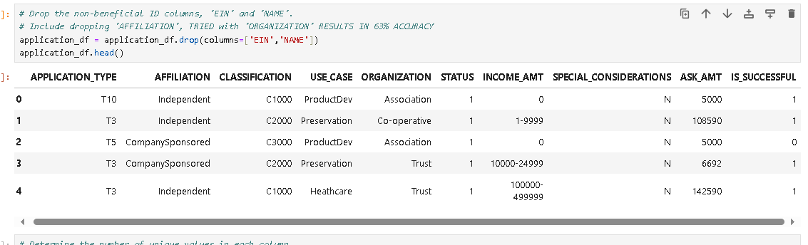
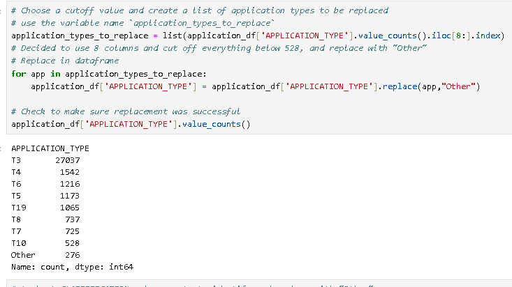
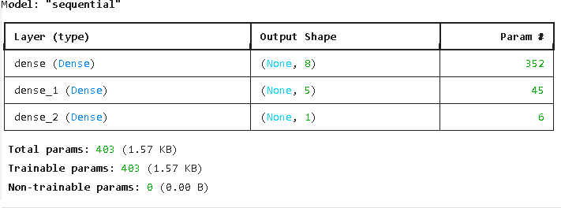
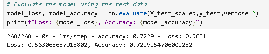
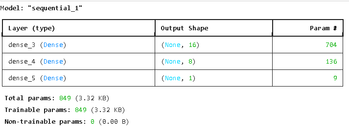
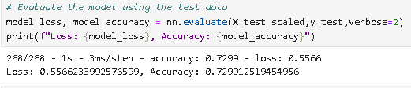
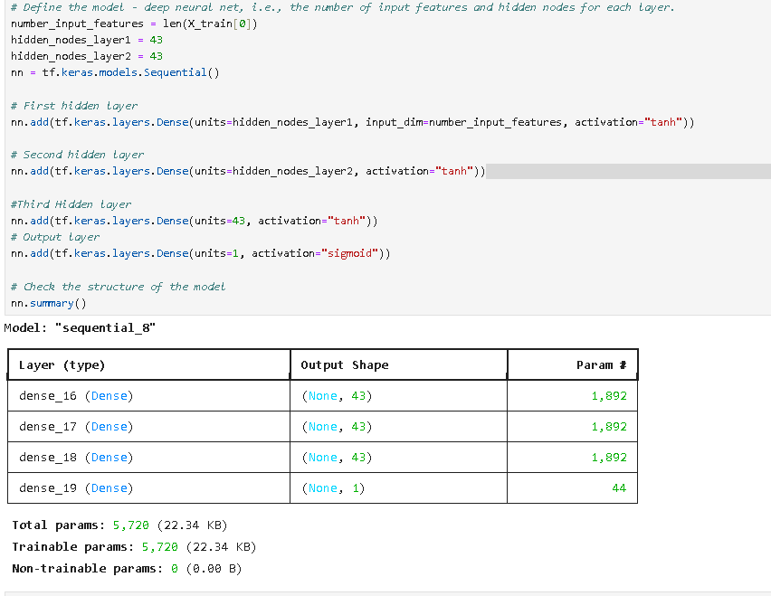

# deep-learning-challenge
Making a neural network model for nonprofit organization

NEURAL NETWORK MODEL REPORT
-------------------------------------------------------------------------------------------------------------------------
Overview:
The purpose of this analysis is to determine if applicants will be successful if funded by the nonprofit organization, Alphabet Soup.

A binary classifier was created using the dataset to predict if success is possible or not.

Data Preprocessing:

-From the dataset, 'IS_SUCCESSFUL' is the targeted variable for the model. The rest in the image are features.

-Beforehand, two columns 'EIN' and 'NAME' were dropped as they were deemed neither a target nor a feature.
-Attempting to create a model with them created a model with a weird number of parameters but high accuracy.

-Categories were reclassified such that values of the 'CLASSIFICATION' column below a certain count were recategorized to 'OTHERS'

Compiling, Training, and Evaluating the Model:

-For the initial testing, the number of input features after getting the dummies is 43, and was predetermined to only have 1 predetermined output. 
-For the first hidden layer, I used 8 hidden nodes, and 5 hidden nodes on the second. 
-After training the model for 100 epochs, accuracy as settled down at 72% with a loss at 56%

-After doing so methods of optimization were pursued, such as removing more columns, such as 'AFFILIATION','ORGANIZATION', and 'USE_CASE'
-However removing all three, two, or even one of these columns resulted in accuracy 10% lower than initial testing.
-Thus, it was decided to not remove any columns aside from those initially removed in the first testing.

Further research was made into what better number of hidden nodes should be implemented, and reading into (1) and (2) shows that the most number would be between
the number of inputs and outputs. Trying multiple numbers, between 1-43, accuracy didnt change much aside from hovering between 71-73%, and never increased to 75% which 
is the target model performance.

Changing activation to 'tanh', adding another hidden layer, increase the number of nodes, still didnt change the model accuracy of 73%, despite 
some epochs' accuracy to rise to 74%.
SUMMARY:
The created model has a 73% change of prediction accuracy if an applicant will succeed if funded by the organization.
As model performance did not improve after performing these known optimization methods, it can be said that perhaps a better option would be to use OneHotEncoder instead of get_dummies to improve model performance, if doing machine learning according to (3) . Perhaps another option would be to gather more data than what the dataset has.

All in all, numerous methods were used and none prevailed to improve model performance to the target level of 75%.
REFERENCES:
1.http://dstath.users.uth.gr/papers/IJRS2009_Stathakis.pdf
2.https://stackoverflow.com/questions/3345079/estimating-the-number-of-neurons-and-number-of-layers-of-an-artificial-neural-ne
3.https://www.geeksforgeeks.org/why-one-hot-encoding-improves-machine-learning-performance/#:~:text=One%2Dhot%20encoding%20ensures%20that,calculations%20and%20better%20model%20performance.